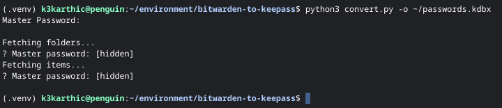

# Convert BitWarden Vault to KeePass Database (kdbx)

Python script to convert a [BitWarden][1] Vault into a [KeePass][2] Database
(kdbx).

## Design

The script reads a BitWarden vault (either remote or a local unencrypted
Bitwarden JSON file).

Folder structure is imported as well as all four [Bitwarden item types][4].

### Drawbacks

BitWarden supports many URLs for an entry while [PyKeePass][5] only supports a
single URL. The script only copies the first URL into the KeePass database. The
rest are copied into the `notes` field. likewise, for any bitwarden `card` or
`identity` type entries, the fields (with labels) will be imported into the
`notes` field.

Pykeepass [requires entries to have a unique title and username combination][6].
The script adds a suffix to the title (e.g, `name (1)`, `name (2)`) in case of a
collision.

## Code Mirrors

* GitHub: [github.com/k3karthic/bitwarden-to-keepass](https://github.com/k3karthic/bitwarden-to-keepass/)
* Codeberg: [codeberg.org/k3karthic/bitwarden-to-keepass](https://codeberg.org/k3karthic/bitwarden-to-keepass/)

## Requirements

Software required to run the script,
* Python 3.7+
* [BitWarden CLI][3]

## Installation

The script can be run as is, or installed using pip, venv and/or pipx. To avoid
any conflicts with other applications named `convert.py`, the script is named
`bw2kp` when installed via pip or setup.py.

1. Install the script (including dependencies) to ~/.local/bin/bw2kp:
   (RECOMMENDED)
   
```
    $ pip install --user .
    $ bw2kp -o bitwarden.kdbx
```   
   
OR

2. Install the Python dependencies of the script using pip and run in place:

```
    $ pip install -r requirements.txt
    $ ./convert.py -o bitwarden.kdbx
```

OR

3. Install into a venv:
   
```
    $ python -m venv .venv
    $ source .venv/bin/activate
    $ pip install .
    $ deactivate
    $ .venv/bin/bw2kp -o bitwarden.kdbx
```

## Usage

```
   $ convert.py [-h] [-i INPUT FILE] [-r] -o OUTPUT FILE
```
 
 OR (if application is installed via pip)
 
```
   $ bw2kp [-h] [-i INPUT FILE] [-r] -o OUTPUT FILE
```

### Options

* `-i --input` input filename (unencrypted JSON) (optional)
* `-o --output` output kdbx filename
* `-r --replace` don't ask before replacing output file if it exists

You need to provide your password only once at the start. The password for the
Keepass database will be the same as your Bitwarden password.



[](https://asciinema.org/a/449042)

### Non-Interactive

The BitWarden password can be set in the environment variable `BITWARDEN_PASS`.
This allows the script to run without requiring user input (assuming 2FA is not
enabled on the accout).

    $ BITWARDEN_PASS="<password>" bw2kp -o <path to output kdbx>

### Local File

You can use a local json export (unencrypted) of the BitWarden vault.
[Instructions for exporting a vault][7].

    $ bw2kp <path to vault json> -o <path to output kdbx>


## Testing

Run unit tests using the following command,

    $ python -m unittest

[1]: https://bitwarden.com/ "Bitwarden.com"
[2]: https://keepass.info/ "Keepass"
[3]: https://bitwarden.com/help/article/cli/ "Bitwarden CLI"
[4]: https://bitwarden.com/help/article/cli/#enums "Bitwarden Item Types"
[5]: https://github.com/libkeepass/pykeepass#adding-entries "Pykeepass Adding Entries"
[6]: https://github.com/libkeepass/pykeepass/blob/master/pykeepass/pykeepass.py#l612 "Pykeepass Unique Entries"
[7]: https://bitwarden.com/help/article/export-your-data/ "Bitwarden Export"
